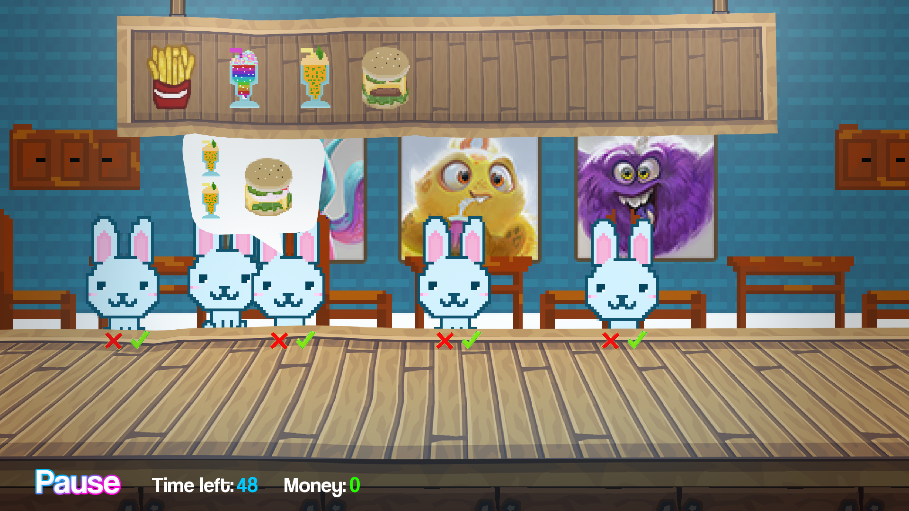
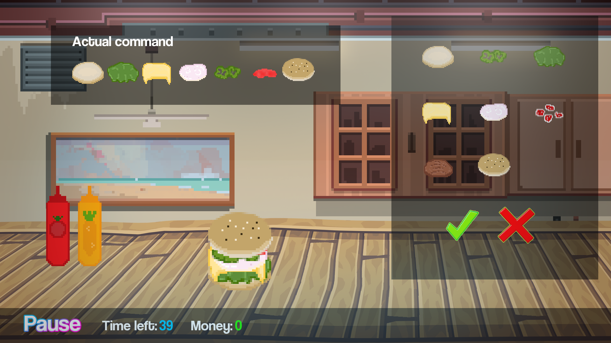

# my_cook
Jeu de cuisine en C en utilisant la librairie CSFML. <br/>
Note : 75




## Dépendances

Pour installer CSFML / SFML sur votre machine linux, veuillez-vous référer au lien suivant : https://blaxpirit.com/blog/12/build-sfml-and-csfml-on-linux.html

## Exemple

```
make
./my_cook
```
